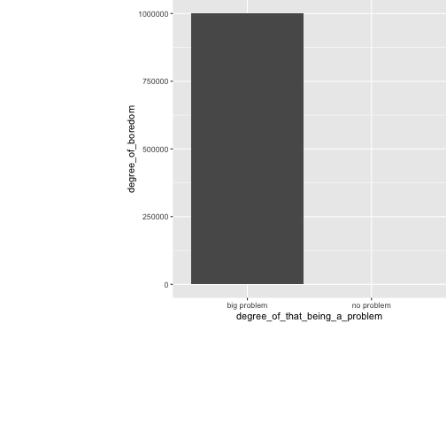

# 04 June 2017
# Movie Predictor
Reproducible Pitch for the Developing Data Science Coursera Class

---

## The Problem
Ever been so bored out of your mind that you had to resort to browsing youtube 
and 9gag and related pages for relief? Well, fear no more, thanks to modern
machine learning technology, now there is now a better way to waste larger 
chuncks of time in a much more qualitative fashion!
 

---- 
## The Solution
My new movie prediction tool allows you to discover quality movies to watch, 
after rating just 10 movies that you have watched before, offering hours of
sweet unproductive bliss with barely any search up-front time.

Just rate 10 movies and click "Run Prediction!" - and voila you get a whole list
of ways to spend 2 hours happily lingering in front of your screen without so 
moving a finger.

----
## The How-I-Did-It
This tool is based on a small share of the Netflix prize data. Based on the 
great guide by [Edwin Chen](http://blog.echen.me/2011/10/24/winning-the-netflix-prize-a-summary/) I created the following features:

- Normalized Global Effects Variables
- Temporal Effects
- A Neighborhood Model
- A Matrix Factorization Model

I trained a model on 200.000 Ratings of 149,473 users on 79 movies. Why not all 100,000,000+ Ratings on all 17,000+ movies? Because that would have taken 
half a year caluclation time.

----
## The App
<iframe src = 'https://preineke.shinyapps.io/movie_predict/' height='600px'></iframe>

